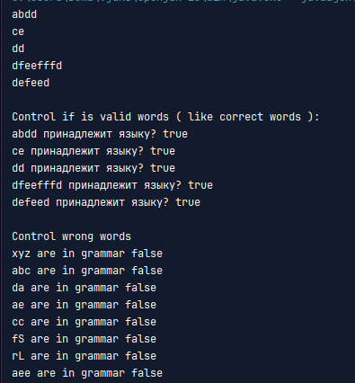

# Intro to formal languages. Regular grammars. Finite Automata.

### Course: Formal Languages & Finite Automata
### Author: Belih Dmitrii

----

## Theory
&ensp;&ensp;&ensp; A formal language can be considered to be the media or the format used to convey information from a sender entity to the one that receives it. The usual components of a language are:
- The alphabet: Set of valid characters;
- The vocabulary: Set of valid words;
- The grammar: Set of rules/constraints over the lang.
  **Connection in LFA:**
- **Finite automata** act as "checkers" to verify if a string belongs to a language.
- **Grammars** act as "builders" to generate all valid strings in a language.

Together, they help study how languages (like programming or pattern rules) are structured and processed.

**Grammar (in LFA):**  
A set of rules to build valid strings in a language, like a recipe. For example, if you want to make a valid sentence, the rules might say: "A sentence can be a noun followed by a verb." Then "noun" could be "cat" or "dog," and "verb" could be "runs" or "sleeps." Starting with the rule, you replace parts until you get a valid string (e.g., "cat runs"). Grammars define *how* to create correct sentences, while automata *check* if a sentence follows the rules.
**Finite Automaton (FA):**  
Imagine a simple machine that reads an input (like a string of symbols) step by step. It has a few "states" (like moods) and switches between them based on the input. For example, think of a door with a security code: it starts "locked," and if you enter the correct digits (input), it moves to "unlocked." If it ends in the "unlocked" state, the input is accepted. If not, it’s rejected. It’s like a flowchart that says "yes" or "no" to a sequence of steps.

## Objectives:

1. Discover what a language is and what it needs to have in order to be considered a formal one;

2. Provide the initial setup for the evolving project that you will work on during this semester. You can deal with each laboratory work as a separate task or project to demonstrate your understanding of the given themes, but you also can deal with labs as stages of making your own big solution, your own project. Do the following:

   a. Create GitHub repository to deal with storing and updating your project;

   b. Choose a programming language. Pick one that will be easiest for dealing with your tasks, you need to learn how to solve the problem itself, not everything around the problem (like setting up the project, launching it correctly and etc.);

   c. Store reports separately in a way to make verification of your work simpler (duh)

3. According to your variant number, get the grammar definition and do the following:

   a. Implement a type/class for your grammar;

   b. Add one function that would generate 5 valid strings from the language expressed by your given grammar;

   c. Implement some functionality that would convert and object of type Grammar to one of type Finite Automaton;

   d. For the Finite Automaton, please add a method that checks if an input string can be obtained via the state transition from it;

## Implementation description

# `Grammar` Class Description

The `Grammar` class represents a formal grammar used for generating strings based on predefined production rules. It also provides functionality to convert the grammar into a finite automaton.

## **Fields**

### **Private Fields**

- `Set<String> nonTerminals`\
  Represents the set of non-terminal symbols (`VN`).
- `Set<String> terminals`\
  Represents the set of terminal symbols (`VT`).
- `static Map<String, List<String>> productions`\
  A map containing production rules (`P`), where each key is a non-terminal, and the value is a list of possible production expansions.
- `String startSymbol`\
  The start symbol (`S`) of the grammar.
- `static Random random`\
  A `Random` instance used to randomly generate valid strings.

## **Methods**

### 1.

```java
public List<String> generateStrings()
```
The `generateStrings()` function is a Java method that generates a list of random strings and returns them. Below is a step-by-step explanation of its functionality:

1. **Initialization**:
    - It creates an empty `ArrayList` of type `String` called `generatedStrings` to store the generated strings.

2. **Loop**:
    - It uses a `for` loop that runs **5 times** (from `i = 0` to `i = 4`). In each iteration:
        - It calls a helper method `generateWord("S")` to generate a random string. The `"S"` passed as an argument suggests that the generation process might start with or be based on the letter "S" (though the exact logic of `generateWord` is not provided).
        - The generated string is printed to the console using `System.out.println(generatedWord)`.
        - The generated string is added to the `generatedStrings` list.

3. **Return**:
    - After the loop completes, the function returns the `generatedStrings` list containing the 5 generated strings.

### **2** (Private, Static)

```java
private static String generateWord(String symbol)
```

The `generateWord` method is a private static helper function in Java that generates a random string based on a given symbol and a set of production rules. It uses recursion to construct the final string. Below is a detailed explanation of its functionality:

1. **Input**:
    - The method takes a `String symbol` as input, which represents the starting symbol for generating the string.

2. **Terminal Symbol Check**:
    - It first checks if the `symbol` is a terminal symbol (i.e., it does not exist in the `productions` map).
        - If the `symbol` is terminal, it is returned as-is.

3. **Non-Terminal Symbol Handling**:
    - If the `symbol` is non-terminal (i.e., it exists in the `productions` map):
        - A random production rule is selected from the list of rules associated with the `symbol` in the `productions` map.
        - The selected rule is processed recursively to construct the final string.

4. **Recursive Processing**:
    - The method iterates over each character in the selected rule:
        - For each character, the `generateWord` method is called recursively to generate the corresponding substring.
        - The results are appended to a `StringBuilder` object to construct the final string.

5. **Return**:
    - The method returns the fully constructed string as a `String`.

#### Key Components:
- **`productions` Map**:
    - A map (likely `Map<String, List<String>>`) that stores production rules for non-terminal symbols. Each key is a non-terminal symbol, and the value is a list of possible rules (strings) that can replace the symbol.
- **Random Selection**:
    - A random rule is selected using `random.nextInt(productions.get(symbol).size())`, ensuring variability in the generated strings.
- **Recursion**:
    - The method uses recursion to handle nested symbols and rules, allowing for complex string generation.


### **3. **``

```java
public FiniteAutomata toFiniteAutomaton()
```
The `toFiniteAutomaton` method converts a context-free grammar (represented by the current object) into a finite automaton. It constructs the automaton's states, alphabet, transitions, initial state, and final states based on the grammar's non-terminal symbols, terminal symbols, and production rules. Below is a detailed explanation of its functionality:

1. **Initialization**:
    - **States**: A set of states is created using the non-terminal symbols (`nonTerminals`).
    - **Alphabet**: A set of alphabet symbols is created using the terminal symbols (`terminals`).
    - **Transitions**: A nested map (`Map<String, Map<String, Set<String>>>`) is initialized to store transitions between states based on input symbols.
    - **Initial State**: The start symbol (`startSymbol`) of the grammar is set as the initial state of the automaton.
    - **Final States**: A set of final states is initialized to store accepting states.

2. **Transition Construction**:
    - For each non-terminal symbol in the `productions` map:
        - A new entry is added to the `transitions` map for the non-terminal symbol.
        - For each production rule associated with the non-terminal symbol:
            - The first symbol of the production rule is extracted (`firstSymbol`).
            - The remaining part of the production rule is extracted (`rest`), if any.
            - A transition is added from the non-terminal symbol to the `rest` (or `firstSymbol` if `rest` is empty) on the input `firstSymbol`.
            - If the `firstSymbol` is a terminal symbol, it is added to the set of final states.

3. **Return**:
    - A `FiniteAutomata` object is created and returned, encapsulating the constructed states, alphabet, transitions, initial state, and final states.

#### Key Components:
- **`nonTerminals`**: A set of non-terminal symbols in the grammar, used as states in the automaton.
- **`terminals`**: A set of terminal symbols in the grammar, used as the alphabet of the automaton.
- **`productions`**: A map (`Map<String, List<String>>`) storing production rules for each non-terminal symbol.
- **`startSymbol`**: The start symbol of the grammar, used as the initial state of the automaton.
- **`FiniteAutomata`**: A class representing the finite automaton, constructed using the provided components.

## **Usage Example**

```java
Set<String> nonTerminals = new HashSet<>(Arrays.asList("S", "L", "R"));
Set<String> terminals = new HashSet<>(Arrays.asList("a", "b", "c", "d", "e","f"));
String startSymbol = "S";

Grammar grammar = new Grammar(
        nonTerminals,
        terminals,
        rules,
        startSymbol
);

List<String> generatedWords = grammar.generateStrings();
```


# `FiniteAutomata` Class Description

The `FiniteAutomata` class represents a finite automaton, which is a mathematical model used for recognizing patterns and validating string acceptance in a formal language.

## **Fields**

### **Private Fields**
- `Set<String> states`  
  Represents the set of states (`Q`) of the finite automaton.
- `Set<String> alphabet`  
  Represents the input alphabet (`Σ`), which contains allowed input symbols.
- `Map<String, Map<String, Set<String>>> transitions`  
  Defines the state transition function (`δ`). It maps each state and input symbol to a set of possible next states.
- `String initialState`  
  Represents the initial state (`q0`) from which processing starts.
- `Set<String> finalStates`  
  Represents the set of accepting states (`F`), which determine if an input string is accepted.

Initializes a finite automaton with:
- `states`: The set of states.
- `alphabet`: The set of input symbols.
- `transitions`: The transition function mapping states and symbols to next states.
- `initialState`: The starting state.
- `finalStates`: The set of accepting states.

## **Methods**

### **1. `stringBelongsToLanguage(String inputString)`**
```java
public boolean stringBelongsToLanguage(String inputString)
```
Determines whether the given string is accepted by the finite automaton.

#### **Logic**:
1. **Initialize**: Start from the initial state.
2. **Process Input**: For each symbol in the input string:
    - Determine all possible next states.
    - If no valid transitions exist, return `false` (string is rejected).
3. **Check Acceptance**: If at least one of the final states is reached at the end, return `true` (string is accepted), otherwise return `false`.

#### **Example Usage**:
```java
FiniteAutomata fa = grammar.toFiniteAutomaton();

System.out.println("\nControl if is valid words ( like correct words ):");
for (String word : generatedWords) {
System.out.println(word + " принадлежит языку? " + fa.stringBelongsToLanguage(word));
}

// Проверка заведомо некорректных слов
List<String> incorrectWords = Arrays.asList("xyz", "abc", "da", "ae", "cc", "fS", "rL", "aee");

System.out.println("\nControl wrong words");
for (String word : incorrectWords) {
System.out.println(word + " are in grammar " + fa.stringBelongsToLanguage(word));
}
```

## Conclusions / Screenshots / Results

In conclusion, this lab gave me a nice opportunity to practice classes in JS (I didn't work with them for a long time). Also, due to this lab, I improved my knowledge about grammar and finite automaton and sustained my knowledge with practical tasks.



*As we can see, the results are good...*

## References
- https://github.com/filpatterson/DSL_laboratory_works/blob/master/1_RegularGrammars/task.md
- https://en.wikipedia.org/wiki/Finite-state_machine
