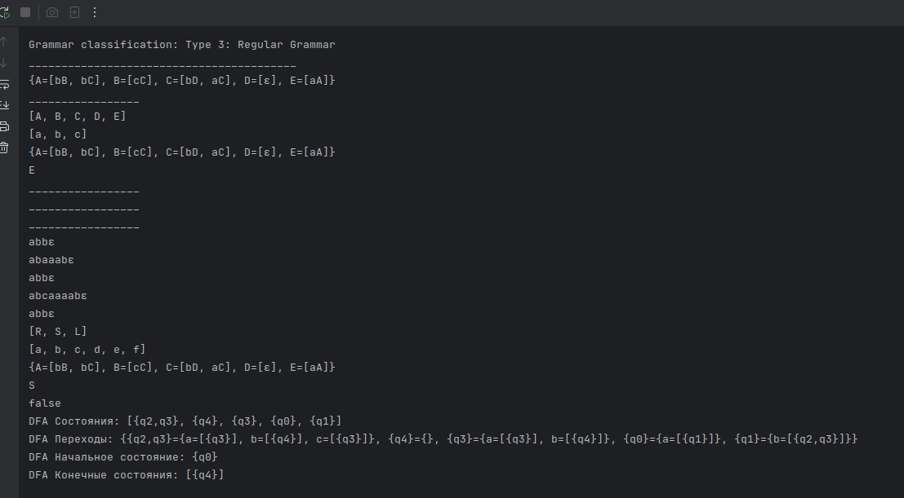

# Finite Automaton and Grammar Classification.

### Course: Formal Languages & Finite Automata
### Author: Belih Dmitrii

----

## Theory
&ensp;&ensp;&ensp; A finite automaton is a mechanism used to represent processes of different kinds. It can be compared to a state machine as they both have similar structures and purpose as well. The word finite signifies the fact that an automaton comes with a starting and a set of final states. In other words, for process modeled by an automaton has a beginning and an ending.

&ensp;&ensp;&ensp; Based on the structure of an automaton, there are cases in which with one transition multiple states can be reached which causes non determinism to appear. In general, when talking about systems theory the word determinism characterizes how predictable a system is. If there are random variables involved, the system becomes stochastic or non deterministic.

&ensp;&ensp;&ensp; That being said, the automata can be classified as non-/deterministic, and there is in fact a possibility to reach determinism by following algorithms which modify the structure of the automaton.
## Objectives:

1. Understand what an automaton is and what it can be used for.

2. Continuing the work in the same repository and the same project, the following need to be added: a. Provide a function in your grammar type/class that could classify the grammar based on Chomsky hierarchy.

   a. For this you can use the variant from the previous lab.

3. According to your variant number (by universal convention it is register ID), get the finite automaton definition and do the following tasks:
   a. Implement conversion of a finite automaton to a regular grammar.

   b. Determine whether your FA is deterministic or non-deterministic.

   c. Implement some functionality that would convert an NDFA to a DFA.


## Implementation description

# `Grammar` Class Description

The `Grammar` class represents a formal grammar used for generating strings based on predefined production rules. It also provides functionality to convert the grammar into a finite automaton.

## **Fields**

### **Private Fields**

- `Set<String> nonTerminals`\
  Represents the set of non-terminal symbols (`VN`).
- `Set<String> terminals`\
  Represents the set of terminal symbols (`VT`).
- `static Map<String, List<String>> productions`\
  A map containing production rules (`P`), where each key is a non-terminal, and the value is a list of possible production expansions.
- `String startSymbol`\
  The start symbol (`S`) of the grammar.
- `static Random random`\
  A `Random` instance used to randomly generate valid strings.

## **Methods**

### 1.

```java
public List<String> generateStrings()
```
The `generateStrings()` function is a Java method that generates a list of random strings and returns them. Below is a step-by-step explanation of its functionality:

1. **Initialization**:
    - It creates an empty `ArrayList` of type `String` called `generatedStrings` to store the generated strings.

2. **Loop**:
    - It uses a `for` loop that runs **5 times** (from `i = 0` to `i = 4`). In each iteration:
        - It calls a helper method `generateWord("S")` to generate a random string. The `"S"` passed as an argument suggests that the generation process might start with or be based on the letter "S" (though the exact logic of `generateWord` is not provided).
        - The generated string is printed to the console using `System.out.println(generatedWord)`.
        - The generated string is added to the `generatedStrings` list.

3. **Return**:
    - After the loop completes, the function returns the `generatedStrings` list containing the 5 generated strings.

### **2** (Private, Static)

```java
private static String generateWord(String symbol)
```

The `generateWord` method is a private static helper function in Java that generates a random string based on a given symbol and a set of production rules. It uses recursion to construct the final string. Below is a detailed explanation of its functionality:

1. **Input**:
    - The method takes a `String symbol` as input, which represents the starting symbol for generating the string.

2. **Terminal Symbol Check**:
    - It first checks if the `symbol` is a terminal symbol (i.e., it does not exist in the `productions` map).
        - If the `symbol` is terminal, it is returned as-is.

3. **Non-Terminal Symbol Handling**:
    - If the `symbol` is non-terminal (i.e., it exists in the `productions` map):
        - A random production rule is selected from the list of rules associated with the `symbol` in the `productions` map.
        - The selected rule is processed recursively to construct the final string.

4. **Recursive Processing**:
    - The method iterates over each character in the selected rule:
        - For each character, the `generateWord` method is called recursively to generate the corresponding substring.
        - The results are appended to a `StringBuilder` object to construct the final string.

5. **Return**:
    - The method returns the fully constructed string as a `String`.

#### Key Components:
- **`productions` Map**:
    - A map (likely `Map<String, List<String>>`) that stores production rules for non-terminal symbols. Each key is a non-terminal symbol, and the value is a list of possible rules (strings) that can replace the symbol.
- **Random Selection**:
    - A random rule is selected using `random.nextInt(productions.get(symbol).size())`, ensuring variability in the generated strings.
- **Recursion**:
    - The method uses recursion to handle nested symbols and rules, allowing for complex string generation.


### **3. **``

```java
public FiniteAutomata toFiniteAutomaton()
```
The `toFiniteAutomaton` method converts a context-free grammar (represented by the current object) into a finite automaton. It constructs the automaton's states, alphabet, transitions, initial state, and final states based on the grammar's non-terminal symbols, terminal symbols, and production rules. Below is a detailed explanation of its functionality:

1. **Initialization**:
    - **States**: A set of states is created using the non-terminal symbols (`nonTerminals`).
    - **Alphabet**: A set of alphabet symbols is created using the terminal symbols (`terminals`).
    - **Transitions**: A nested map (`Map<String, Map<String, Set<String>>>`) is initialized to store transitions between states based on input symbols.
    - **Initial State**: The start symbol (`startSymbol`) of the grammar is set as the initial state of the automaton.
    - **Final States**: A set of final states is initialized to store accepting states.

2. **Transition Construction**:
    - For each non-terminal symbol in the `productions` map:
        - A new entry is added to the `transitions` map for the non-terminal symbol.
        - For each production rule associated with the non-terminal symbol:
            - The first symbol of the production rule is extracted (`firstSymbol`).
            - The remaining part of the production rule is extracted (`rest`), if any.
            - A transition is added from the non-terminal symbol to the `rest` (or `firstSymbol` if `rest` is empty) on the input `firstSymbol`.
            - If the `firstSymbol` is a terminal symbol, it is added to the set of final states.

3. **Return**:
    - A `FiniteAutomata` object is created and returned, encapsulating the constructed states, alphabet, transitions, initial state, and final states.

### **Method: `classifyGrammar()`**

#### **Purpose**
This method analyzes the grammar's production rules and determines its classification based on the **Chomsky hierarchy**. It checks whether the grammar is:
1. **Type 3 (Regular Grammar)**
2. **Type 2 (Context-Free Grammar)**
3. **Type 1 (Context-Sensitive Grammar)**
4. **Type 0 (Unrestricted Grammar)**

The method returns the most restrictive type that applies to the grammar.

---

#### **How It Works**
1. **Initialization**:
    - Three boolean flags (`isType3`, `isType2`, `isType1`) are initialized to `true`. These flags represent whether the grammar satisfies the conditions for **Type 3**, **Type 2**, and **Type 1** respectively.

2. **Iterate Through Production Rules**:
    - The method iterates through all production rules in the grammar.
    - For each rule, it checks the left-hand side (LHS) and the right-hand side (RHS).

3. **Type 3 (Regular Grammar) Check**:
    - A grammar is **Type 3** if its rules are either:
        - **Right-linear**: `A → aB` or `A → a`, where `A` and `B` are non-terminals, and `a` is a terminal.
        - **Left-linear**: `A → Ba` or `A → a`, where `A` and `B` are non-terminals, and `a` is a terminal.
    - The method checks:
        - If the RHS has length `1`, it must be a terminal.
        - If the RHS has length `2`, it must be either:
            - A terminal followed by a non-terminal (`aB`), or
            - A non-terminal followed by a terminal (`Ba`).
    - If any rule violates these conditions, `isType3` is set to `false`.

4. **Type 2 (Context-Free Grammar) Check**:
    - A grammar is **Type 2** if all rules are of the form:
        - `A → α`, where `A` is a single non-terminal, and `α` is a string of terminals and/or non-terminals.
    - The method checks:
        - If the LHS is not a single non-terminal, `isType2` is set to `false`.

5. **Type 1 (Context-Sensitive Grammar) Check**:
    - A grammar is **Type 1** if all rules are of the form:
        - `αAβ → αγβ`, where `A` is a non-terminal, `α` and `β` are strings of symbols, and `γ` is a non-empty string.
        - Additionally, the length of the RHS must be greater than or equal to the length of the LHS (`|γ| >= |A|`).
    - The method checks:
        - If the length of the RHS is less than the length of the LHS, `isType1` is set to `false`.

6. **Determine Grammar Type**:
    - After checking all rules, the method returns the most restrictive type that applies:
        - If `isType3` is `true`, the grammar is **Type 3 (Regular)**.
        - If `isType3` is `false` but `isType2` is `true`, the grammar is **Type 2 (Context-Free)**.
        - If both `isType3` and `isType2` are `false` but `isType1` is `true`, the grammar is **Type 1 (Context-Sensitive)**.
        - If none of the above conditions are met, the grammar is **Type 0 (Unrestricted)**.

---

#### **Example Output**
- If the grammar satisfies **Type 3** conditions, the method returns:

```Type 3: Regular Grammar```
- If the grammar satisfies **Type 2** conditions but not **Type 3**, the method returns:

```Type 2: Context-Free Grammar```

- If the grammar satisfies **Type 1** conditions but not **Type 2** or **Type 3**, the method returns:

```Type 1: Context-Sensitive Grammar```

- If the grammar does not satisfy any of the above conditions, the method returns:

```Type 0: Unrestricted Grammar```
#### Key Components:
- **`nonTerminals`**: A set of non-terminal symbols in the grammar, used as states in the automaton.
- **`terminals`**: A set of terminal symbols in the grammar, used as the alphabet of the automaton.
- **`productions`**: A map (`Map<String, List<String>>`) storing production rules for each non-terminal symbol.
- **`startSymbol`**: The start symbol of the grammar, used as the initial state of the automaton.
- **`FiniteAutomata`**: A class representing the finite automaton, constructed using the provided components.

## **Usage Example**

```java
Set<String> nonTerminals = new HashSet<>(Arrays.asList("S", "L", "R"));
Set<String> terminals = new HashSet<>(Arrays.asList("a", "b", "c", "d", "e","f"));
String startSymbol = "S";

Grammar grammar = new Grammar(
        nonTerminals,
        terminals,
        rules,
        startSymbol
);

List<String> generatedWords = grammar.generateStrings();
```


# `FiniteAutomata` Class Description

The `FiniteAutomata` class represents a finite automaton, which is a mathematical model used for recognizing patterns and validating string acceptance in a formal language.

## **Fields**

### **Private Fields**
- `Set<String> states`  
  Represents the set of states (`Q`) of the finite automaton.
- `Set<String> alphabet`  
  Represents the input alphabet (`Σ`), which contains allowed input symbols.
- `Map<String, Map<String, Set<String>>> transitions`  
  Defines the state transition function (`δ`). It maps each state and input symbol to a set of possible next states.
- `String initialState`  
  Represents the initial state (`q0`) from which processing starts.
- `Set<String> finalStates`  
  Represents the set of accepting states (`F`), which determine if an input string is accepted.

Initializes a finite automaton with:
- `states`: The set of states.
- `alphabet`: The set of input symbols.
- `transitions`: The transition function mapping states and symbols to next states.
- `initialState`: The starting state.
- `finalStates`: The set of accepting states.

## **Methods**

### **1. `stringBelongsToLanguage(String inputString)`**
```java
public boolean stringBelongsToLanguage(String inputString)
```
Determines whether the given string is accepted by the finite automaton.

#### **Logic**:
1. **Initialize**: Start from the initial state.
2. **Process Input**: For each symbol in the input string:
    - Determine all possible next states.
    - If no valid transitions exist, return `false` (string is rejected).
3. **Check Acceptance**: If at least one of the final states is reached at the end, return `true` (string is accepted), otherwise return `false`.

#### **Example Usage**:
```java
FiniteAutomata fa = grammar.toFiniteAutomaton();

System.out.println("\nControl if is valid words ( like correct words ):");
for (String word : generatedWords) {
System.out.println(word + " принадлежит языку? " + fa.stringBelongsToLanguage(word));
}

// Проверка заведомо некорректных слов
List<String> incorrectWords = Arrays.asList("xyz", "abc", "da", "ae", "cc", "fS", "rL", "aee");

System.out.println("\nControl wrong words");
for (String word : incorrectWords) {
System.out.println(word + " are in grammar " + fa.stringBelongsToLanguage(word));
}
```
---

#### **1. Method: `toGrammar()`**

##### **Purpose**
Converts a finite automaton (FA) into an equivalent **regular grammar**. This is useful for transforming automata into a grammar representation, which can then be used for language generation or analysis.

##### **How It Works**
1. **State Mapping**:
    - Each state in the FA is mapped to a non-terminal symbol (e.g., `q0 -> A`, `q1 -> B`, etc.).
    - This ensures that the grammar's non-terminals are distinct and follow a naming convention.

2. **Non-Terminals and Terminals**:
    - The non-terminals of the grammar are the renamed states of the FA.
    - The terminals of the grammar are the symbols in the FA's alphabet.

3. **Production Rules**:
    - For each transition in the FA, a production rule is created in the grammar.
    - If a state has a transition on symbol `a` to state `q1`, the production rule is `A → aB` (where `A` and `B` are the mapped names for `q0` and `q1` respectively).
    - If a state is a final state, an epsilon (`ε`) production is added (e.g., `A → ε`).

4. **Return the Grammar**:
    - The method returns a `Grammar` object with the constructed non-terminals, terminals, production rules, and start symbol.

### Method: `isDeterministic()`
How It Works

Transition Analysis:

    The method iterates through all transitions in the FA.

    For each state and symbol, it checks if there is more than one possible next state.

    If any transition has multiple next states for the same symbol, the automaton is non-deterministic.

Return Result:

    Returns true if the automaton is deterministic (no ambiguities in transitions).

    Returns false if the automaton is non-deterministic.


## Method: `convertToDFA()`

### Purpose

Converts a non-deterministic finite automaton (NFA) into an equivalent deterministic finite automaton (DFA). This is done using the subset construction algorithm.

### How It Works

#### Initialization:

- A queue is used to process new DFA states (which are sets of NFA states).
- A map (`dfaStateNames`) is used to assign unique names to DFA states.
- A map (`dfaTransitions`) is used to store transitions for the DFA.

#### Epsilon Closure:

- The initial state of the DFA is the epsilon closure of the NFA's initial state.
- The epsilon closure of a state includes all states reachable via epsilon transitions.

#### Subset Construction:

- For each DFA state, transitions are computed for each symbol in the alphabet.
- The next state for a symbol is the epsilon closure of all states reachable from the current DFA state on that symbol.
- New DFA states are added to the queue for processing.

#### Final States:

- A DFA state is marked as final if it contains any final state of the NFA.

#### Return the DFA:

- The method returns a new `FinitaAutomata` object representing the DFA.

### Example

```java
FinitaAutomata nfa = ...; // Some non-deterministic finite automaton
FinitaAutomata dfa = nfa.convertToDFA();
System.out.println(dfa.getTransitions()); // Outputs the DFA transitions
```

## Method: `epsilonClosure()`

### Purpose

Computes the epsilon closure of a set of states in an NFA. The epsilon closure includes all states reachable from the given states via epsilon (ε) transitions.

### How It Works

#### Initialization:

- The closure set is initialized with the input states.
- A stack is used to process states for epsilon transitions.

#### Epsilon Transitions:

- For each state, the method checks if there are epsilon transitions.
- If an epsilon transition leads to a new state, it is added to the closure and pushed onto the stack.

#### Return the Closure:

- The method returns the set of all states in the epsilon closure.

## Conclusions / Screenshots / Results

In conclusion, this lab gave me a nice opportunity to practice classes in JS (I didn't work with them for a long time). Also, due to this lab, I improved my knowledge about grammar and finite automaton and sustained my knowledge with practical tasks.



*As we can see, the results are good...*

## References
- https://github.com/filpatterson/DSL_laboratory_works/blob/master/1_RegularGrammars/task.md
- https://en.wikipedia.org/wiki/Finite-state_machine
